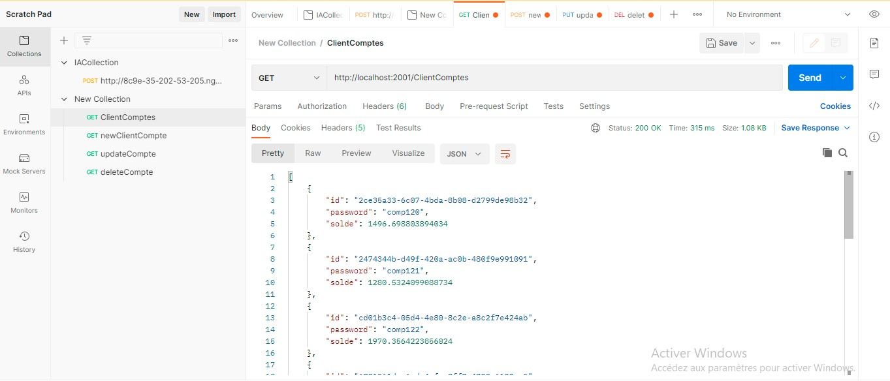
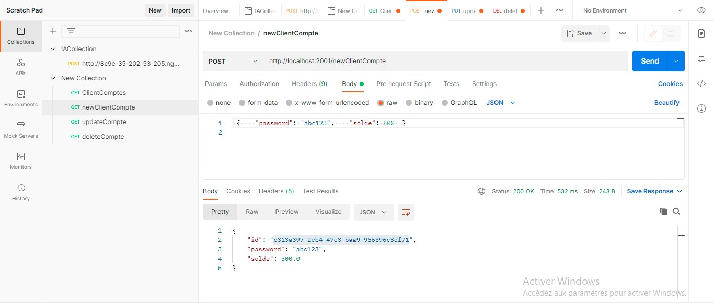
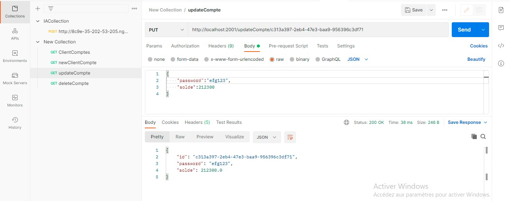
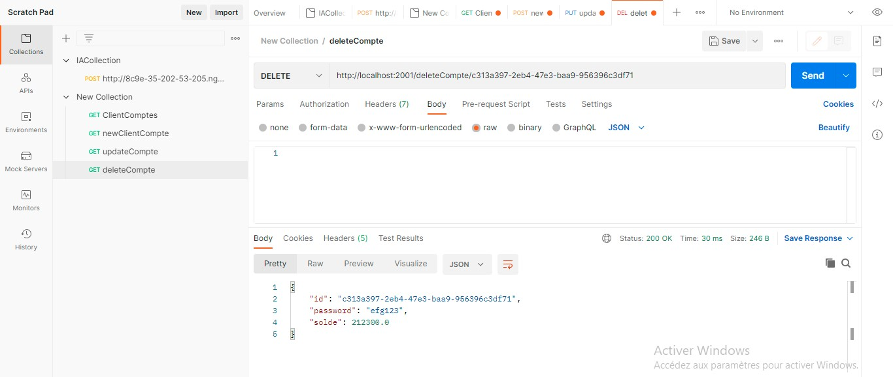
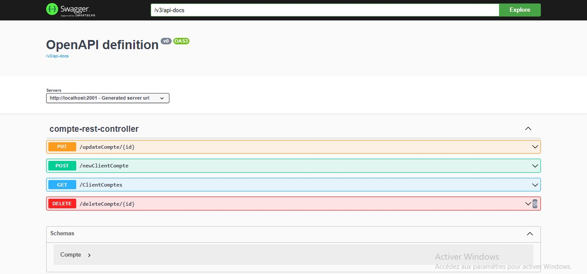
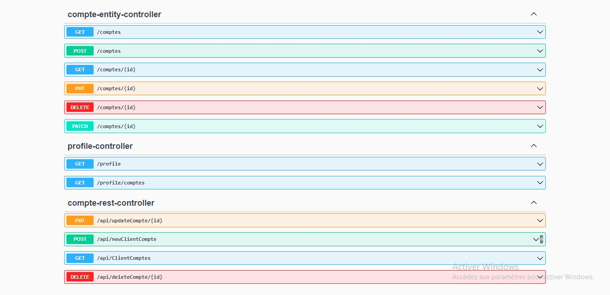
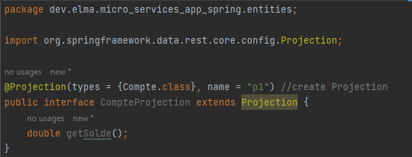

# Micro_Services_App_Spring
### In this repository:
build a crude application to handle bank accounts using the following concepts:
* Spring Data JPA
* Hibernet
* Restfull API
* GRPC
* H2 DataBase

**1. Create JPA Account**
<table>
<tr>
<td width="100%">
          <h3 align="center">JPA Account</h3>
          

             
            

        </td>
</tr>
</table>

**2. Create CompteRepository**
<table>
<tr>
<td width="100%">
          <h3 align="center">CompteRepository</h3>
          

             
            

        </td>
</tr>
</table>

**3. DAO Test**
<table>
<tr>
<td width="50%">
          <h3 align="center">CompteRepository</h3>
          

             
            

 </td>
 <td width="50%">
          <h3 align="center">Result</h3>
          

             
            

 </td>
</tr>
</table>

**4. Web service Restfull**
<table>
<tr>
<td width="100%">
          <h3 align="center">CompteRestController</h3>
          

             
            

        </td>
</tr>
</table>

**5. Test services with Postman**

<table>
<tr>
<td width="50%">
          <h3 align="center">Get All</h3>
          

             
            

  </td>
  <td width="50%">
          <h3 align="center">Add new</h3>
          

             
            

        </td>
</tr>
<tr>
<td width="50%">
          <h3 align="center">Update</h3>
          

             
            

  </td>
  <td width="50%">
          <h3 align="center">Delete</h3>
          

             
            

        </td>
</tr>
</table>

**6. Documentation of RestAPI with Swagger**

<table>
          <td width="100%">
                    <h3 align="center">Swagger Documentation</h3>
                    </img>
          </td>
</table>

**7. Using Spring Data Rest**

Spring Data could create web services rest linked with jpa repository just we need to add **@RepositoryRestResources** to RepositoryClass.

<table>
          <tr>
                    <td>
                    <h3 align="center">Swagger Documentation for Spring Data Rest</h3>
                    </img>
                    </td>
          <tr>
</table>

**8. Projection**

You can utilize Projection in the request while using Spring Data Rest. and in order to do this:

* Create **Interface** Projection
* **@Projection(type={x.class},name="nameProjection")** add this notaion to this interface

<table>
          <tr>
                    <td>
                              <h3 align="center">Example</h3>
                              </img>
                    </td>
          </tr>
</table>

**9. Create DTOS/Mappers**
