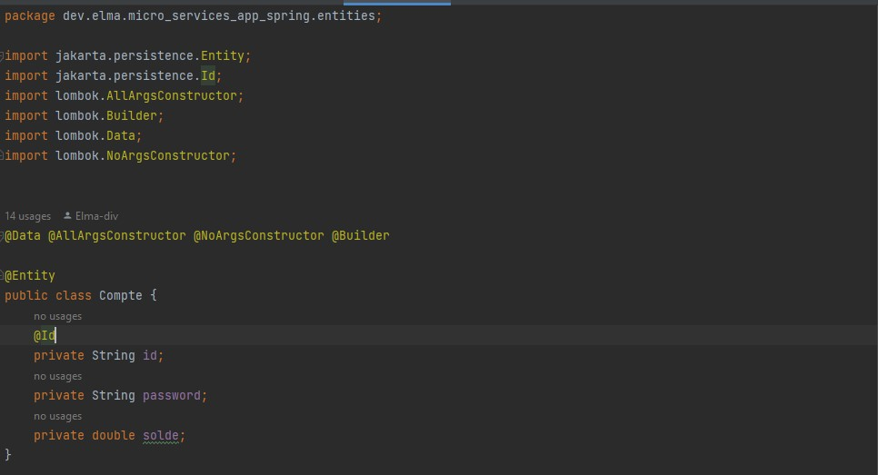
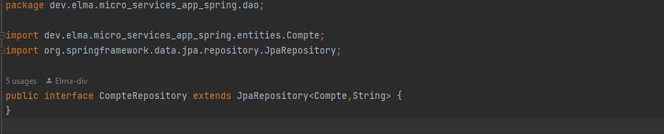
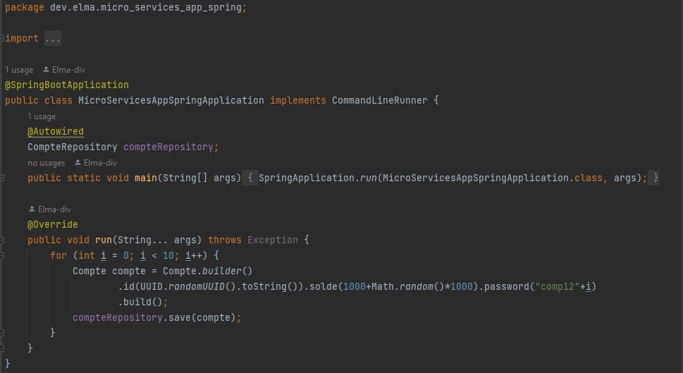
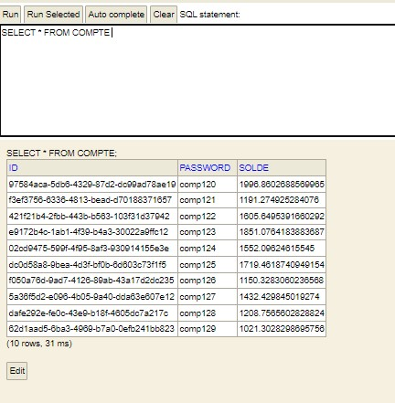
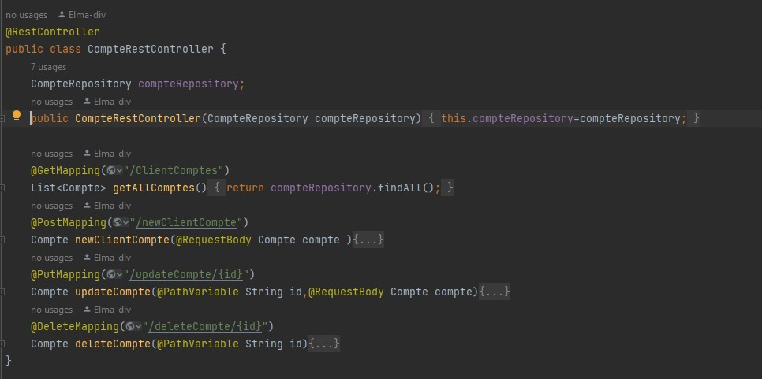

# Micro_Services_App_Spring
### In this repository:
build a crude application to handle bank accounts using the following concepts:
* Spring Data JPA
* Hibernet
* Restfull API
* GRPC
* H2 DataBase

**1. Create JPA Account**
<table>
<tr>
<td width="100%">
          <h3 align="center">JPA Account</h3>
          

             
            

        </td>
</tr>
</table>

**2. Create CompteRepository**
<table>
<tr>
<td width="100%">
          <h3 align="center">CompteRepository</h3>
          

             
            

        </td>
</tr>
</table>

**3. DAO Test**
<table>
<tr>
<td width="50%">
          <h3 align="center">CompteRepository</h3>
          

             
            

 </td>
 <td width="50%">
          <h3 align="center">Result</h3>
          

             
            

 </td>
</tr>
</table>

**4. Web service Restfull**
<table>
<tr>
<td width="100%">
          <h3 align="center">CompteRestController</h3>
          

             
            

        </td>
</tr>
</table>
